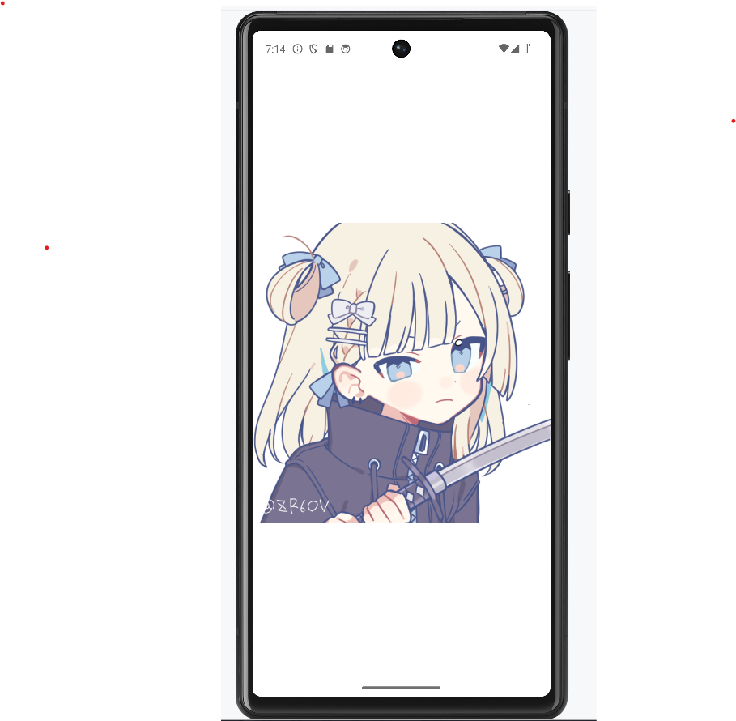
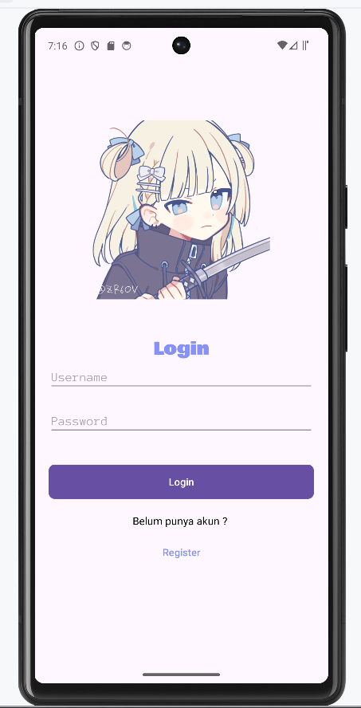
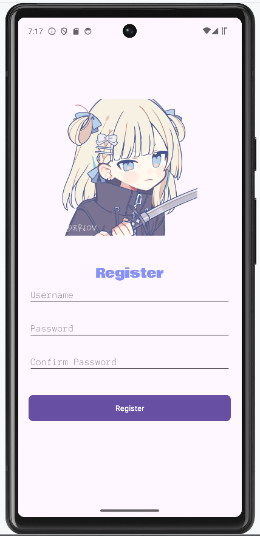
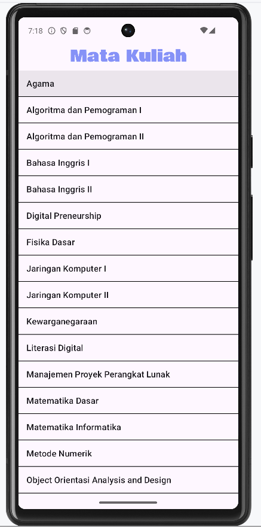
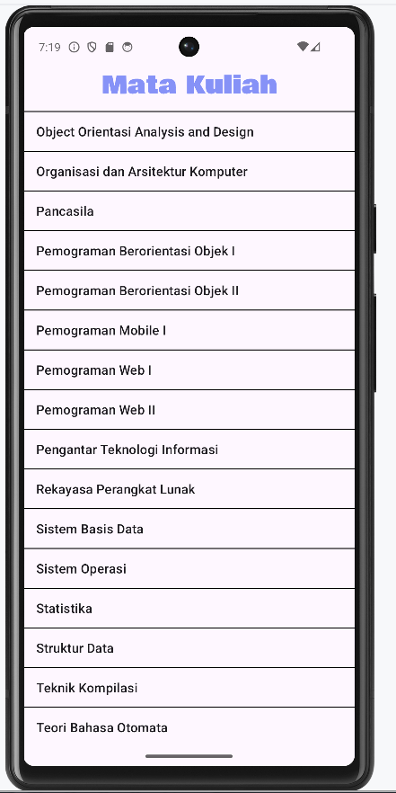

# MEMBUAT PROGRAM SEDERHANA (Kotlin + xml)

* 🔢 [SPLASH SCREEN]
* ❗ [LOGIN ACTIVITY]
* ❗ [REGISTER ACTIVITY]
* ❗ [NEWS PORTAL DASHBOARD ACTIVITY]

  

  </img>

  

  </img>

  

  </img>

  

  </img>

 

  </img>

## Deskripsi

Proyek ini bertujuan untuk membuat program sederhana menggunakan Android Native.

## Fitur

* Splash Screen
* Kolom Text untuk memasukkan username
* Kolom Text untuk memasukkan password
* Kolom Text untuk memasukkan confirm password
* ImageView
* Tombol Alert
* List View
* ℹ️ Menampilkan pemberitahuan

## Teknologi

* 🪲 Kotlin
* ️ Android

## Catatan

*  Program ini masih dalam tahap pengembangan.
*  Fitur yang tersedia masih terbatas.
